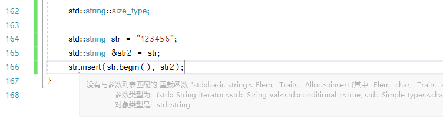
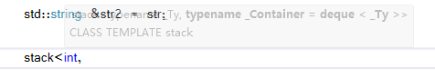
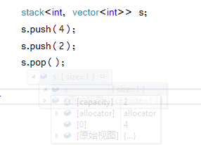

# 第九章 vector string 适配器

## vector 对象是如何增长的

容器大小管理操作 | 概述 
------------- | ------------- 
```c.shrink_to_fit``` | 将 capacity() 减少为 size() 相同大小（不保证一定退回内存空间
```c.capacity```  | 不重新分配内存空间的话，c可以保存多少元素
```c.reserve```  | 分配至少能容纳 n 个元素的内存空间

- reserve 只有需要的内存空间超过当前容量是，才会改变 vector 的容量，它至少会分配与需求一样大的内存空间，可能会更大
- capacity 和 size 的区别
- - capacity 是可以容纳的元素大小
- - size 是当前保存的元素的数量

## string 的操作

### string 的构造

构造string的其他方法 | 概述 
------------- | ------------- 
```string s(cp,n)``` | s是 cp指向的数组中的前n个字符的**拷贝**，保证 cp 至少 n 个字符
```string s(s2,pos2)```  | s是 string s2 从下标 pos2 开始的字符的拷贝。保证 pos2 < s2.size()
```string s(s2,pos2,len2)```  | 同上，len2 的值无论多大，最多拷贝到 s2 结束（这里 len2 可以很大

substr  操作 | 概述
------------- | ------------- 
```s.substr(pos,n)``` | 返回一个string，包含 s 中从 pos 开始的 n 个字符的拷贝，他们的默认值，返回的恰好是 s 本身的拷贝

### 改变 string 的其他方法
修改 string 的操作 | 概述 
------------- | ------------- 
```s.insert(pos,args)``` | 在pos**之前**插入args指定的字符。pos可以是一个下标或迭代器。下标版本返回指向 s 的引用，迭代器版本返回指向第一个插入字符的迭代器。 
```s.erase(pos,len)``` | 删除从位置pos开始的 len 个字符。如果 len 被省略，则删除从 pos 开始直至 s 末尾的所有字符。返回值是 s 的引用
```s.assign(args)``` | 全部替换成 args 指定的字符，返回引用
```s.append(args)``` | 直接在后面追加，返回引用
```s.replace(range,args)``` | 删除 s 中 range 内的字符，替换成 args 指定的字符，range 是一个下标加一个长度，或者是一对指向 s 的迭代器。 返回引用

args的形式 | 概述 
------------- | ------------- 
```str``` | 字符串str
```str,pos,len``` | str 中从 pos 开始最多 len 个字
```cp,len``` | 从cp指向的字符数组的前（最多）len 个字符
```cp``` | cp 指向的，以 \\0 结尾的字符数组
```n,c``` | n 个字符 c
```b,e``` | 迭代器表示的范围
```\{...\}``` | 花括号包围，用 逗号 分隔的，字符列表


- args可以是以上之一的形势，append 和 assign 可以用所有形式

- 对于 replace 和 insert 这两个函数，args 不一定是通用的，可以直接查书上的表



- 这个就是没有对应的接口

### string 的搜索操作

- 搜索返回的值类型是 ```string::size_type```，这个值其实是一个 unsigned 类型，所以一般不用 int 这种带符号类型来保存
- 如果找不到，会返回 ```string::npos```，这个其实是对一个 unsigned 类型值，初始化为 -1 的值，可以理解成最大的大小

string 搜索操作 | 概述 
------------- | ------------- 
```s.find(args)``` | 查找s中 args 第一次出现的位置
```s.rfind(args)``` | 查找s中 args 最后一次出现的位置
```s.find_first_of(args)``` | 查找s中 args 中任何一个字符 第一次出现的位置
```s.find_last_of(args)``` | 查找s中 args 中任何一个字符 最后一次出现的位置
```s.find_first_not_of(args)``` | 查找s中 第一个不在 args 的字符出现的位置
```s.find_last_not_of(args)``` |查找s中 最后一个不在 args 的字符出现的位置

args的形式 | 概述 
------------- | ------------- 
```c,pos``` | 从s中位置 pos 开始查找字符 c，pos默认 0
```s2,pos``` | 从s中位置 pos 开始查找字符串 s2，pos默认 0
```cp,pos``` | 从s中位置 pos 开始查找 cp 指向的，以\\0 结尾的C风格字符串，pos默认 0
```cp,n,pos``` | 从从s中位置 pos 开始查找 cp 指向的，前n个字符，pos默认 0


- 写循环搜索，记得要**递增pos**，因为搜索从pos开始，如果找到了，就会返回 pos

### compare 函数
- 这个函数就是一个字符串比较

### 数值转换
- 主要涉及的是，string 向 int，float 等的数值转换（支持正负号开头

string 和 数值之间的转换 | 概述 
------------- | ------------- 
```to_string(val)``` | 返回 val 的 string 表示
```stoi(s,p,b)```| p 是下标，默认是 0，b 是基数，默认 10。
```stol(s,p,b)``` | 
```stoul(s,p,b)``` | 
```stoll(s,p,b)``` | 
```stoull(s,p,b)``` | 
```stof(s,p)``` | 返回浮点数系
```stod(s,p)``` | 
```stold(s,p)``` | 

## 适配器机制

**适配器（adaptor）** 是一个标准库的通用概念，他是一种机制，使得某种底层容器，表现得跟适配器一样。适配器有，**栈（stack）**，**队列（queue）**，**优先队列（priority_queue)**
他们的默认实现分是
- stack：deque
- queue：deque
- priority_queue ：vector



这里的就是默认 deque

我们也可以用其他的底层的数据结构来实现相应的适配器：



核心：适配器机制 = 底层数据结构，通过接口的上层封装