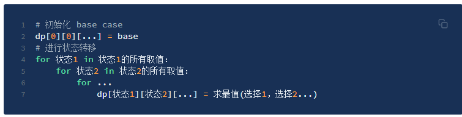
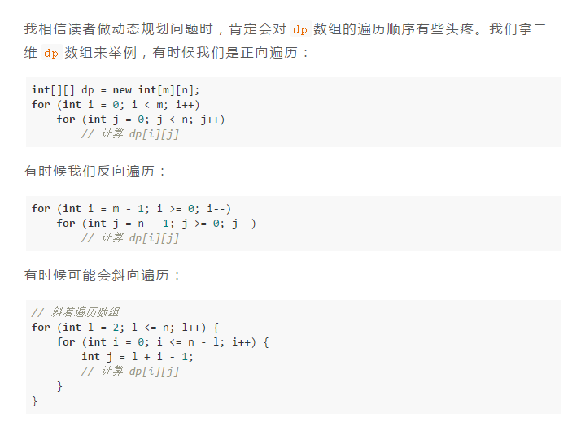
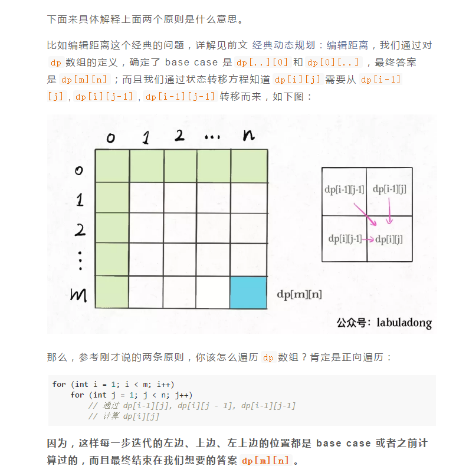
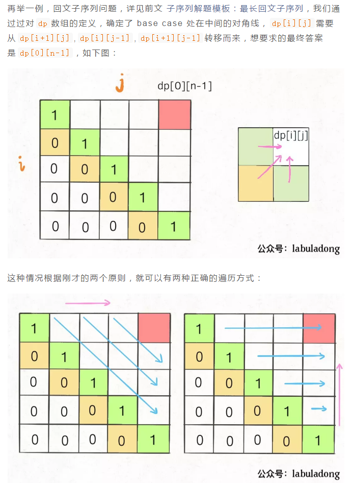

[学习链接](https://labuladong.gitbook.io/algo/di-ling-zhang-bi-du-xi-lie-qing-an-shun-xu-yue-du/dong-tai-gui-hua-xiang-jie-jin-jie)

[力扣链接](https://leetcode-cn.com/problems/fibonacci-number/)

# 斐波那契 - 总体思路

- 建议的解题步骤
  - 明确 base case
  - 明确「状态」**也就是原问题和子问题中会变化的变量。**
  - 明确「选择」**也就是导致「状态」产生变化的行为。**
  - 定义 dp 数组/函数的含义

- 求解动态规划的核心问题是**穷举**
- - 「最优子结构」
- - - **子问题间必须互相独立**
- - 「状态转移方程」
- - - 「 **暴力解**」 千万不要看不起暴力解，动态规划问题最困难的就是写出这个暴力解，即状态转移方程。
- - - 「**状态压缩**」，如果我们发现每次状态转移只需要 DP table 中的一部分，那么可以尝试用状态压缩来缩小 DP table 的大小，只记录必要的数据，上述例子就相当于把DP table 的大小从 n 缩小到 2。
- - 「重叠子问题」
- - - 「**备忘录**」 每次遇到一个子问题先去「备忘录」里查一查，如果发现之前已经解决过这个问题了，直接把答案拿出来用，不要再耗时去计算了。
- - - 「**自底向上**」 问题规模最小的 f(1) 和 f(2) 开始往上推，直到推到我们想要的答案 f(20)，这就是动态规划的思路，这也是为什么动态规划一般都脱离了递归，而是由循环迭代完成计算。

# 最优子结构详解

假设你们学校有 10 个班，你已经计算出了每个班的最高考试成绩。那么现在我要求你计算全校最高的成绩，你会不会算？当然会，而且你不用重新遍历全校学生的分数进行比较，而是只要在这 10 个最高成绩中取最大的就是全校的最高成绩。

- **符合最优子结构**：可以从子问题的最优结果推出更大规模问题的最优结果。让你算每个班的最优成绩就是子问题，你知道所有子问题的答案后，就可以借此推出全校学生的最优成绩这个规模更大的问题的答案。

假设你们学校有 10 个班，你已知每个班的最大分数差（最高分和最低分的差值）。那么现在我让你计算全校学生中的最大分数差，你会不会算？可以想办法算，但是肯定不能通过已知的这 10 个班的最大分数差推到出来。因为这 10 个班的最大分数差不一定就包含全校学生的最大分数差，比如全校的最大分数差可能是 3 班的最高分和 6 班的最低分之差。

- **不符合最优子结构**，因为你没办通过每个班的最优值推出全校的最优值，没办法通过子问题的最优值推出规模更大的问题的最优值。

那么遇到这种最优子结构失效情况，怎么办？策略是：**改造问题**。

**改造问题，也就是把问题等价转化：最大分数差，不就等价于最高分数和最低分数的差么**，那不就是要求最高和最低分数么，不就是我们讨论的第一个问题么，不就具有最优子结构了么？那现在改变思路，借助最优子结构解决最值问题，再回过头解决最大分数差问题，是不是就高效多了？

再举个常见但也十分简单的例子，**求一棵二叉树的最大值**

你看这个问题也符合最优子结构，以root为根的树的最大值，可以通过两边子树（子问题）的最大值推导出来，结合刚才学校和班级的例子，很容易理解吧。

最优子结构并不是动态规划独有的一种性质，能求最值的问题大部分都具有这个性质；**但反过来，最优子结构性质作为动态规划问题的必要条件，一定是让你求最值的，**

# dp 数组的遍历方向

## 遍历的过程中，所需的状态必须是已经计算出来的。

## 遍历的终点必须是存储结果的那个位置。

