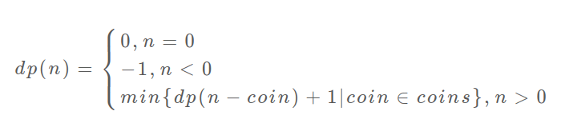

[学习链接](https://labuladong.gitbook.io/algo/di-ling-zhang-bi-du-xi-lie-qing-an-shun-xu-yue-du/dong-tai-gui-hua-xiang-jie-jin-jie)

[力扣链接](https://leetcode-cn.com/problems/coin-change/)

# 硬币问题 - 总体思路

- 建议的解题步骤
  - 明确 base case
  - - 目标金额 amount 为 0 时算法返回 0
  - 明确「状态」
  - - 由于硬币数量无限，硬币的面额也是题目给定的，只有目标金额会不断地向 base case 靠近，所以唯一的「状态」就是目标金额 amount。
  - 明确「选择」
  - - 目标金额为什么变化呢，因为你在选择硬币，你每选择一枚硬币，就相当于减少了目标金额。所以说所有硬币的面值，就是你的「选择」。
  - 定义 dp 数组/函数的含义
  - - dp(n) 的定义：输入一个目标金额 n，返回凑出目标金额 n 的最少硬币数量。

- 求解动态规划的核心问题是**穷举**
- - 「最优子结构」
- - - 凑零钱问题，为什么说它符合最优子结构呢？比如你想求 amount = 11 时的最少硬币数（原问题），如果你知道凑出 amount = 10 的最少硬币数（子问题），你只需要把子问题的答案加一（再选一枚面值为 1 的硬币）就是原问题的答案。因为硬币的数量是没有限制的，所以子问题之间没有相互制，是互相独立的。
- - 「状态转移方程」
- - - 「 **暴力解**」递归计算给出的状态转移方程
- - - 「**状态压缩**」这里的状态是不确定的，所以不能压缩
- - 「重叠子问题」
- - - 「**备忘录**」 这个地方可以做记录，去把递归的计算做一次记录
- - - 「**自底向上**」 这里是可以自底向上，从 0 开始做记录