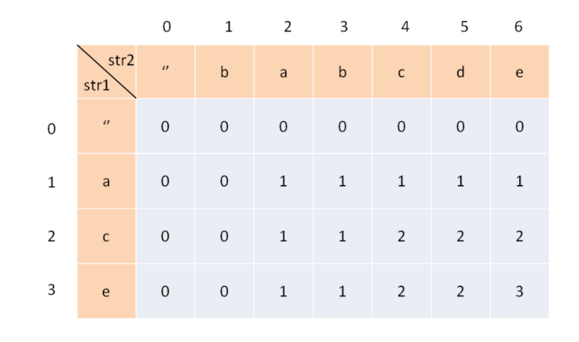
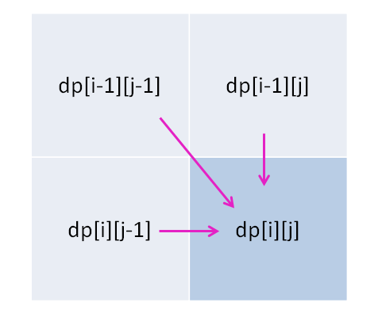

[学习链接](https://labuladong.gitbook.io/algo/dong-tai-gui-hua-xi-lie/zui-chang-gong-gong-zi-xu-lie)

[力扣链接](https://leetcode-cn.com/problems/longest-common-subsequence/)

# 最长公共子序列 - 总体思路

- 建议的解题步骤
  - 明确 dp 的意义
  - - 
    - 通过一张二维数组，横纵分别表示当前两个字符串的长度，内容是lcs的长度
  - 明确 base case
  - - 初始状态就是，当一个字符串为0时，lcs的长度就是0
  - 明确「状态」
  - - 字符串从前往后遍历，改变的状态就是 str1 和 str2 当前的遍历位置
  - 明确「选择」
  - - 
  - - 考虑已知 `table[i][j]`，如果有 `s1[i+1] == s2[j+1]`
  - - - 自然可以推出 `table[i+1][j+1] = table[i][j] + 1`
  - - 如果 `s1[i+1] ！= s2[j+1]`
  - - - 那么 `table[i+1][j+1]` 应该从 `table[i][j], table[i+1][j], table[i][j+1]` 中推导
  - - - 会不会是 `table[i+1][j] + 1` 呢？，假设如果 j行 +1 的话，那么 `s2[j+1]` 一定和 `s1[i+1]` 相等，就回到了相等的假设中
  - - - 同理，i行也不会 +1，所以在不相等的情况下：`table[i+1][j+1] = max(table[i][j], table[i+1][j], table[i][j+1])`
  - - - 因为 `table[i+1][j]` 可以从 `max(table[i][j-1], table[i+1][j-1], table[i][j])` 所以一定有 `table[i+1][j] >= table[i][j]`
  - - - 所以可以简化成 `table[i+1][j+1] = max(table[i+1][j], table[i][j+1])`