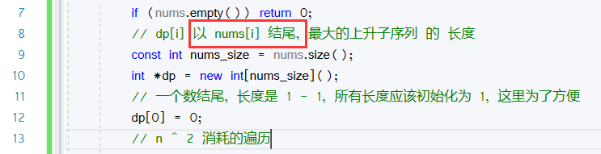
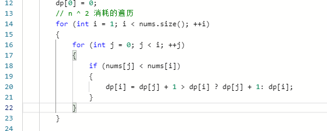
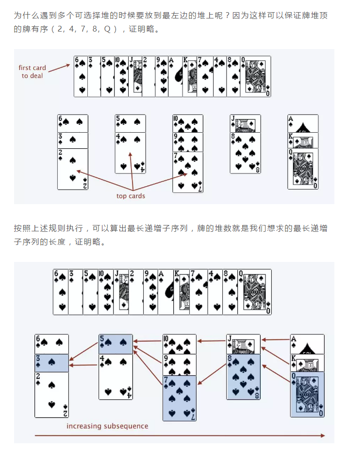

[学习链接](https://labuladong.gitbook.io/algo/dong-tai-gui-hua-xi-lie/zui-chang-gong-gong-zi-xu-lie)

[力扣链接](https://leetcode-cn.com/problems/longest-common-subsequence/)

# 最长公共子序列 - 总体思路

- 建议的解题步骤
  - 明确 dp 的意义
  - - 
    - 注意，这里加了一个 **限制条件**，这个条件的增加非常关键，这样会让 dp 的设定更舒服（结果加一次遍历即可
  - 明确 base case
  - - 初始状态就是，当一个字符串为1时，lus的长度就是1
  - 明确「状态」
  - - 字符串从前往后遍历，改变的状态就是 str 当前的遍历位置
  - 明确「选择」
  - - 
  - - 因为加了**限制条件** 每一个子条件都是以当前结尾，所以判断后决定是否 +1 即可

- 拓展的解题步骤

- 在这里，加速的地方在于，在选择，加入桶时，我们可以做一次二分查找，来优化速度