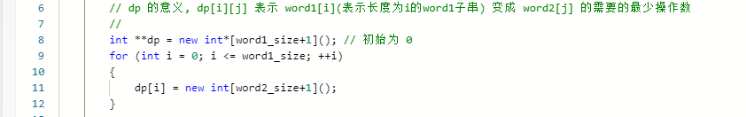
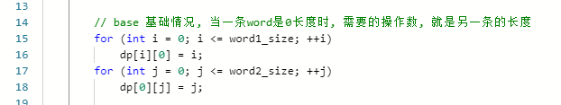
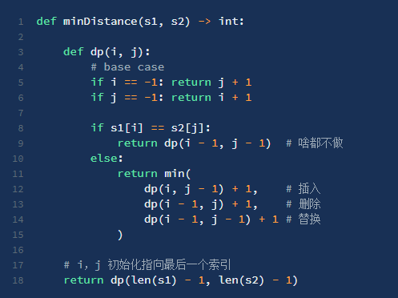

[学习链接](https://labuladong.gitbook.io/algo/dong-tai-gui-hua-xi-lie/zi-xu-lie-wen-ti-mo-ban)

[力扣链接](https://leetcode-cn.com/problems/edit-distance/)

# 编辑距离- 总体思路

- 建议的解题步骤
  - 明确 dp 的意义
  - - 
    - 注意，这里加了一个 **限制条件**，这个条件的增加非常关键，这样会让 dp 的设定更舒服（结果加一次遍历即可
  - 明确 base case
  - - 
  - 明确「状态」
  - - 字符串从前往后遍历，改变的状态就是 i 和 j 当前的遍历位置
  - 明确「选择」
  - - 

# 难点思考
- 将题目，转换成动态规划问题。

