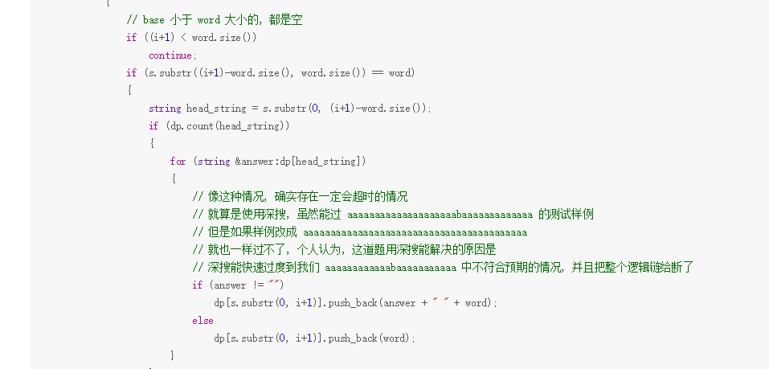

[力扣链接](https://leetcode-cn.com/problems/word-break-ii/submissions/)

# 编辑距离- 总体思路

- 建议的解题步骤
  - 明确 dp 的意义
  - - 
  - 明确 base case
  - - 
  - 明确「状态」
  - - 字符串从前往后遍历，改变的状态就是 i 当前的遍历位置
  - 明确「选择」
  - - 

# 难点思考
- 这道题，可以广搜，可以深搜，可以动归来做，核心问题在于，`aaaaaabaaaaa`的测试样例，只有深搜能够快速过度到不可行，否则只有面向样例编程
