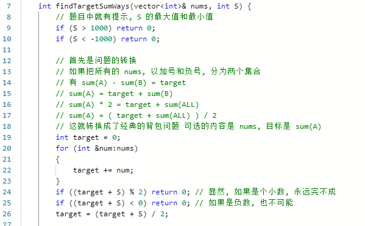
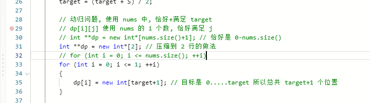
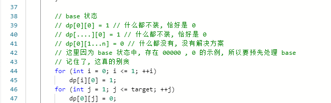
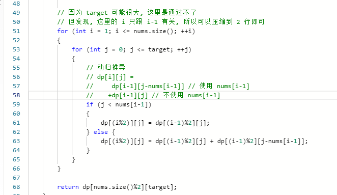
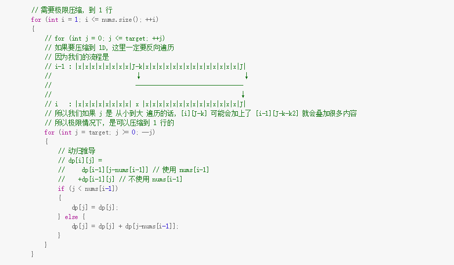

[学习链接](https://labuladong.gitbook.io/algo/dong-tai-gui-hua-xi-lie/1.1-dong-tai-gui-hua-ji-ben-ji-qiao/targetsum)

[力扣链接](https://leetcode-cn.com/problems/target-sum/)

# 目标和- 总体思路

第一步，转换成动态规划问题

- 这道题的优化核心，是优化成

- 建议的解题步骤
  - 明确 dp 的意义
  - - 
  - 明确 base case
  - - 
  - 明确「状态」
  - - i 是可供选择的背包选项
    - j 是目标总和
  - 明确「选择」
  - - 

# 难点思考
- 转换成动态规划问题
- 更极限的状态压缩：
  - 
  - 相关[学习链接](https://labuladong.gitbook.io/algo/dong-tai-gui-hua-xi-lie/1.1-dong-tai-gui-hua-ji-ben-ji-qiao/zhuang-tai-ya-suo-ji-qiao)，在 二维的基础上，做内存压缩（不过可读性极差）
